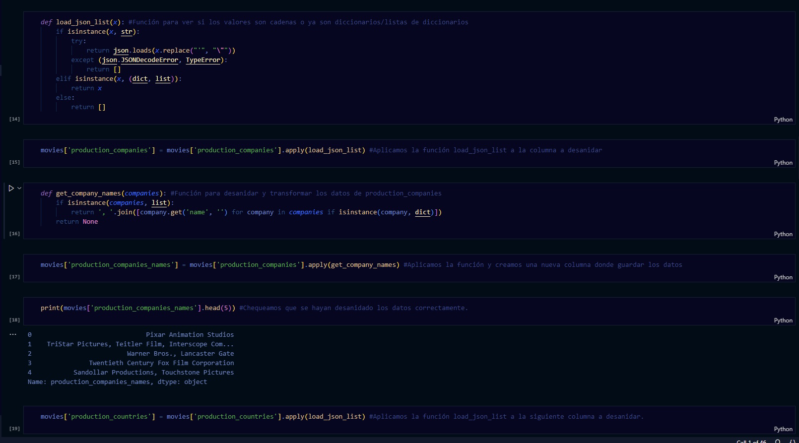
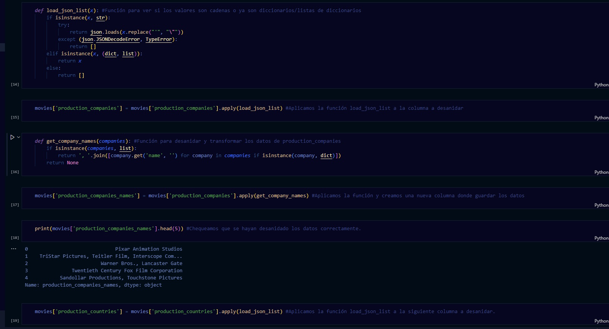
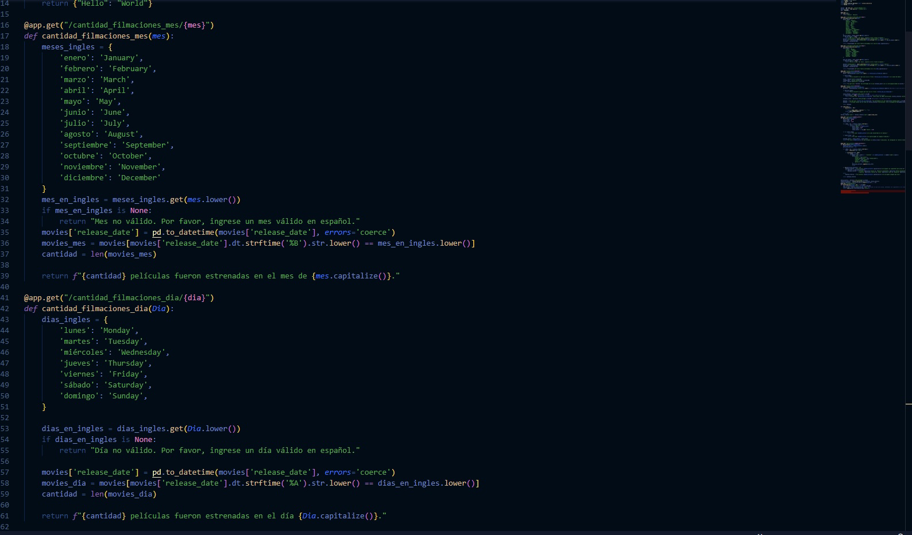
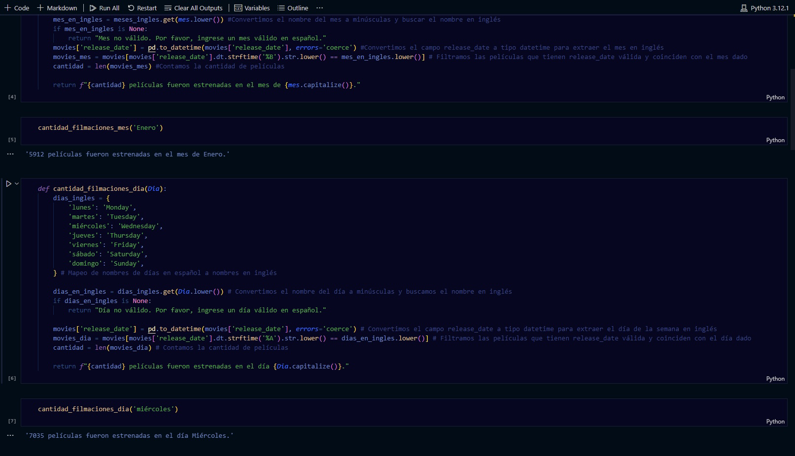
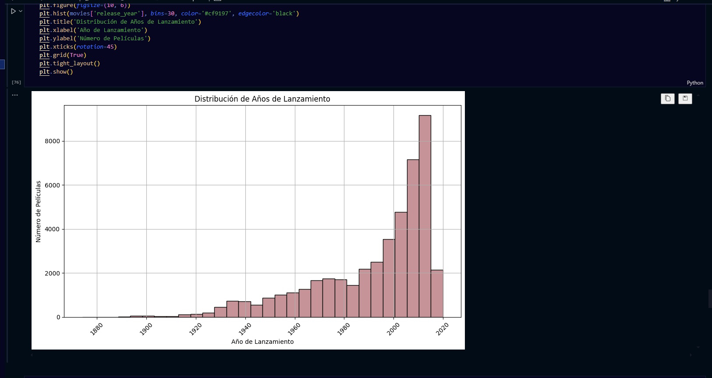
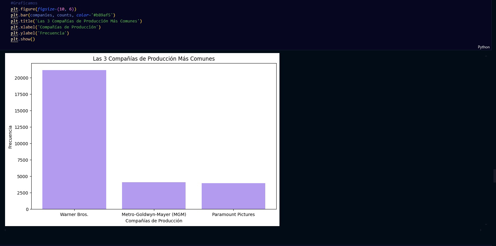

# Proyecto Individual 01:
MLOps. 

En este proyecto, realicé la carga, transformación y extracción de los datasets proporcionados, siguiendo las consignas brindadas. 

Luego, creé las funciones para la API, primero, en un Jupyter Notebook, y luego, en el archivo main.py. Esto lo hice de esta forma, para comprobar que el código de las funciones arroje el resultado esperado. Decidí conservar el Notebook ya que este está comentado y el main.py no, para que se vea mas prolijo. 

Ya casi terminando, avancé con el EDA, el cual fue mi parte favorita de este proyecto. 

Y ya por último, el sistema de recomendación. Este también, lo realicé primero en un Notebook por separado, para poder comentar libremente e ir probando los resultados. Y luego, lo pasé en limpio al archivo main.py

![Recomendaciones] (./images/recomendaciones.jpeg)

Luego de probar con varias alternativas a Render, ya que este me traía varios errores, decidí hacer el deploy tanto con Railway como con Google Cloud, lo cual obviamente me trajo desafíos nuevos, pero se pudo. 

https://pi01-production.up.railway.app
https://pi01-428919.rj.r.appspot.com 

Y por último, grabé el video de demostración. No tengo muy buena webcam, así que pido disculpas de antemano. 

Espero les guste, les deseo buena semana a todos y gracias. 

